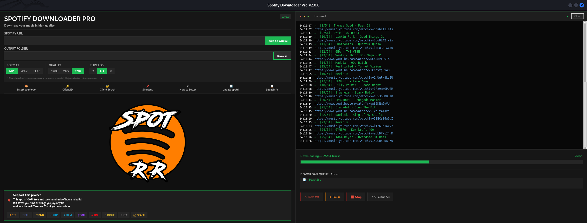

# SpotRR

<p align="center">
  
</p>

<p align="center">
  
  
  
  
</p>

> **For educational use only.** You are responsible for ensuring you have the right to access any content.

<p align="center">
  
</p>

A clean, modern desktop app to get music in MP3, WAV or FLAC.  
**No limits. Your music, your way.**

---

## ⚡ Quick Start

### Windows — one double-click setup

1. **[Download Python 3.10+](https://www.python.org/downloads/)** ← if you don't have it  
   > During install, check **"Add Python to PATH"** ✅

2. **[Download this project](../../archive/refs/heads/main.zip)** and extract the ZIP anywhere

3. Double-click **`setup.bat`**  
   → Installs all dependencies + FFmpeg automatically  
   → Creates a Desktop shortcut  
   → Launches the app

That's it. No manual pip, no manual FFmpeg setup.

---

### Linux / macOS

```bash
# 1. Clone
git clone https://github.com/RRSpot/SpotRR.git
cd SpotRR

# 2. Setup (installs everything + creates shortcut)
bash setup.sh
```

> **Linux prerequisite:** `sudo apt install python3 python3-venv` (Debian/Ubuntu)  
> **macOS prerequisite:** `brew install python`

---

### Manual launch (any OS after setup)

```bash
# Windows
run.bat

# Linux / macOS
bash run.sh
```

---

## ✨ Features

| Feature | Details |
|---|---|
| **Formats** | MP3 · WAV · FLAC |
| **Quality** | 128 kbps · 192 kbps · 320 kbps |
| **Content** | Tracks · Albums · Playlists · Artists |
| **Queue** | Multi-URL queue with reorder support |
| **Threads** | 2 / 4 ★ / 8 parallel tasks |
| **Control** | Stop · Pause · Resume |
| **FFmpeg** | Auto-downloaded on first run |
| **UI** | Dark themed UI, drag & drop |

---

## 🔑 API Credentials (optional but recommended)

Without credentials the app still works, but adding them gives better track labels and avoids shared rate limits.

**Get them in 2 minutes:**

1. Go to [developer.spotify.com/dashboard](https://developer.spotify.com/dashboard) and log in
2. Click **Create app** — any name/description, set Redirect URI to `http://localhost`
3. Open the app → **Settings** → copy **Client ID** and **Client Secret**

**Add them in the app:**

Click the **🔑 Client ID** and **🔑 Client Secret** buttons in the toolbar — or edit `settings.json` directly:

```json
{
    "client_id":     "your_client_id_here",
    "client_secret": "your_client_secret_here"
}
```

---

## 🖥️ How to use

1. Paste a URL (track, album, playlist or artist) into the **SPOTRR URL** field
2. Choose **output folder**, **format** and **quality**
3. Click **Add to Queue**
4. Repeat for as many URLs as you want
5. Press **▶ Start** (or it starts automatically if the queue was empty)

---

## 📁 Project structure

```
SpotRR/
├── spotrr.py               # Main application (single file)
├── requirements.txt        # Python dependencies
├── settings.json           # User config (add your credentials here)
├── setup.bat               # Windows one-click setup
├── setup.sh                # Linux / macOS setup
├── run.bat                 # Windows launcher
├── run.sh                  # Linux / macOS launcher
├── assets/
│   ├── icon.ico            # App icon
│   └── logo.png            # Logo shown in the app
└── downloads/              # Default output folder (auto-created)
```

---

## ⚙️ settings.json reference

| Key | Description | Default |
|---|---|---|
| `client_id` | API Client ID | `""` |
| `client_secret` | API Client Secret | `""` |
| `default_output_folder` | Where files are saved | `""` (~/Downloads) |
| `custom_logo_path` | Path to a custom logo image | `""` |
| `preferred_format` | `mp3` / `wav` / `flac` | `mp3` |
| `preferred_quality` | `128k` / `192k` / `320k` | `320k` |

---

## 🔧 Troubleshooting

**"Python is not installed"** → Download from [python.org](https://www.python.org/downloads/) and check *Add to PATH* during install.

**"FFmpeg not found"** → Run `setup.bat` / `setup.sh` again — it downloads FFmpeg automatically via spotdl.

**HTTP 429 errors** → Rate limit. Reduce threads to 2 or 4 and try again. The app retries automatically 3 times.

**App doesn't open on Windows** → Right-click `run.bat` → *Run as administrator*.

---

## 📦 Dependencies

| Package | Purpose |
|---|---|
| `spotdl` | Core engine (wraps yt-dlp + metadata) |
| `spotipy` | Web API client |
| `Pillow` | Image / logo rendering |
| `tkinterdnd2` | Drag-and-drop support |
| `mutagen` | Audio metadata tagging |
| `rapidfuzz` | Fuzzy title matching |
| `qrcode` | Donation QR codes |
| `requests` | HTTP client |

All installed automatically by `setup.bat` / `setup.sh`.

---

## ⚠️ Legal

This software is provided **for educational purposes only**.  
The developer assumes no liability for misuse.  
See [LICENSE](LICENSE) for full terms.
